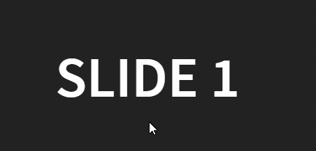

# plugin-revealjs-mouse-pointer

Dummy Mouse Pointer for RevealJS

## Usage

Add `mouse-pointer.js` file to revealjs folder: `plugin/mouse-pointer/` and add the following to the html presentation file:

See `example.html` for simple example using CDN.

Press CAPSLOCK to enable the mouse pointer

```html
<script>
Reveal.initialize({
	dependencies: [
			... 
		{ src: 'plugin/mouse-pointer/mouse-pointer.js', async: true }, 
	] 
});
</script>
```
	
## Demo

